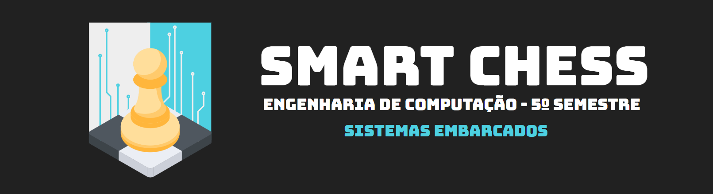
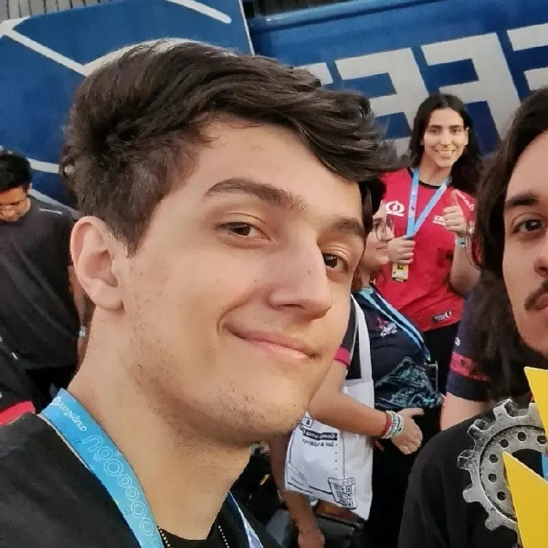
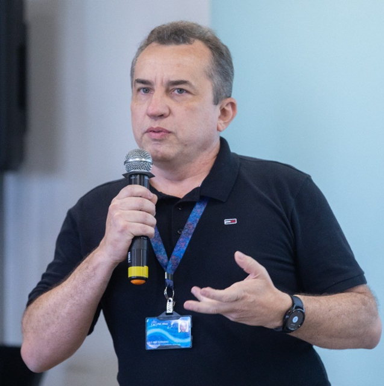
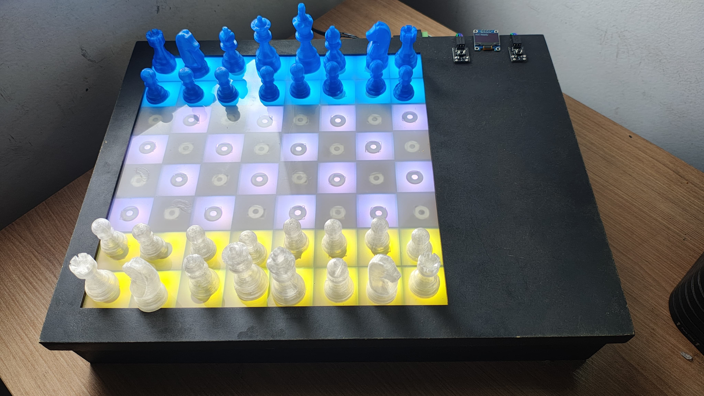
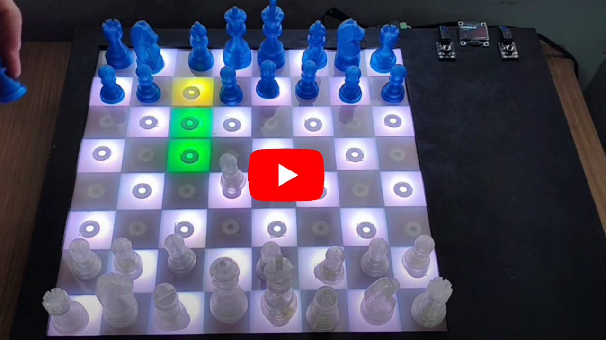
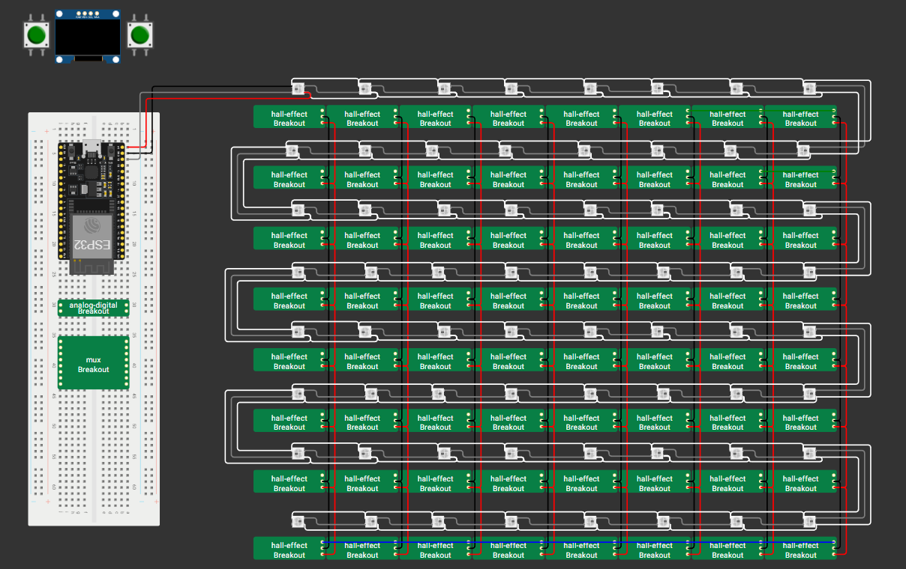
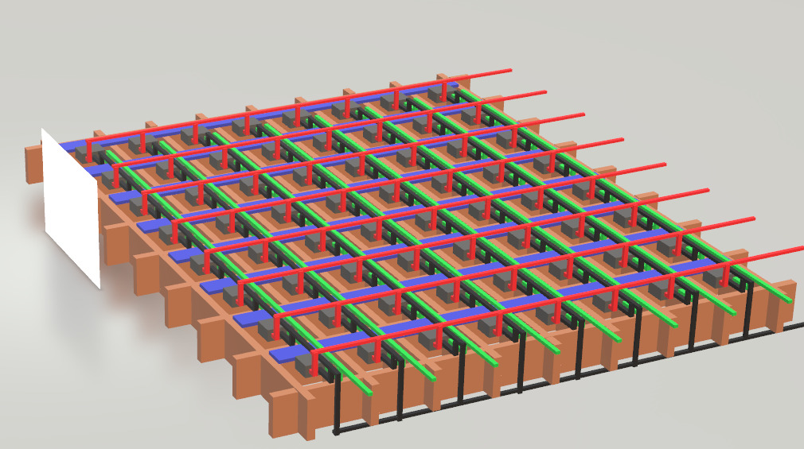
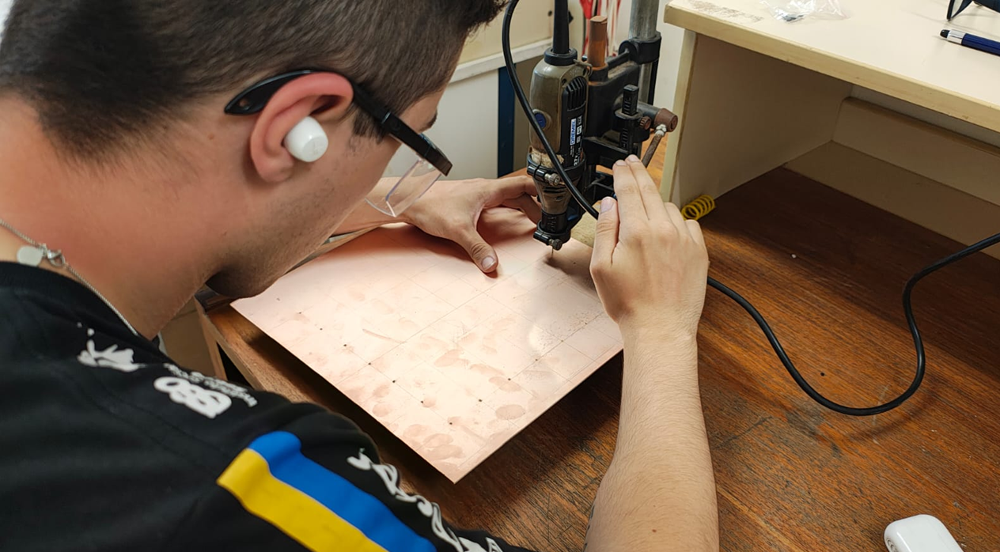
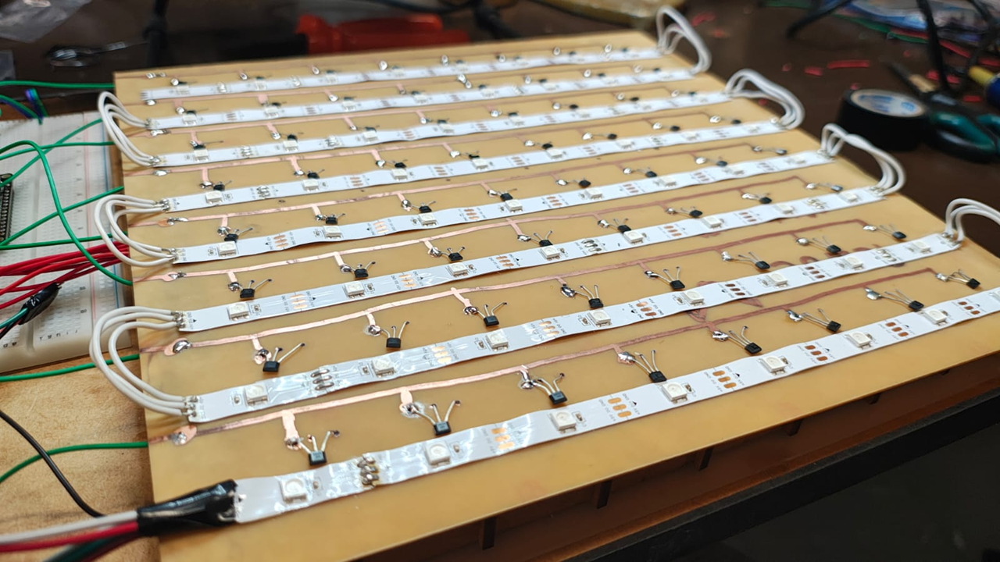

  

  &nbsp;
  
Membros

  <table>
    <tr>
      <td align="center">
        <a href="https://github.com/RafaelBrandaoBastos" title="GitHub de Rafael Brandão">
           
          <b>Rafael Brandão</b>
        </a>
      </td>
      <td align="center">
        <a href="https://github.com/Awakened-Redstone" title="GitHub de Marcos Dias">
           
          <b>Marcos Dias</b>
        </a>
      </td>
      <td align="center">
        <a href="https://github.com/MattosPedro" title="GitHub de Pedro Lucas">
           
          <b>Pedro Lucas</b>
        </a>
      </td>
      <td align="center">
         
        <b>Rodrigo Rocha</b>
      </td>
    </tr>
  </table>

  
Colaboradores

  <table>
    <tr>
      <td align="center">
        <a href="https://www.linkedin.com/in/pedro-carneiro-rabetim-11156222a/" title="LinkedIn de Pedro Carneiro">
           
          <b>Pedro Carneiro</b>
        </a>
      </td>
      <td align="center">
        <a href="https://www.linkedin.com/in/mario-buratto-047b3630/" title="LinkedIn de Mario Buratto">
           
          <b>Prof Mario B.</b>
        </a>
      </td>
      <td align="center">
        <a href="https://www.linkedin.com/in/ilorivero/" title="LinkedIn de Ilo Ribeiro">
           
          <b>Prof Ilo Ribeiro</b>
        </a>
      </td>
    </tr>
  </table>

  &nbsp;
  <h4>
    <a href="https://docs.google.com/presentation/d/1VIV1RzR2Ix15h-qzxkjWqXIEae58qMObAb_RhvPVKN8/edit?usp=sharing">Apresentação</a>
     · 
    <a href="https://github.com/Chess-Game-Challenge/Code/tree/develop">Código</a>
     · 
    <a href="https://wokwi.com/projects/406405257341848577">Circuito</a>
  </h4>

<h2>Visão Geral</h2>

A iniciativa do projeto é criar um tabuleiro de xadrez inteligente que possa ensinar a jogadores iniciantes as regras do xadrez. O tabuleiro possui sensores magnéticos para detectar o movimento das peças e luzes para realizar a indicação dos movimentos. Futuramente irá contar com análise de melhores/piores jogadas, detecção de xeque/xeque mate, integração com IA's jogadoras de xadrez, integração com serviços online como chess.com.

<h2>Galeria</h2>

  
  
  
  
  
  

